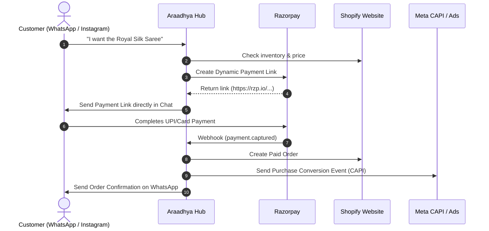

# 👗 Araadhya Fashion — Unified Commerce Hub

> **Unified Omni-Channel Commerce & Automation Engine connecting Shopify, Razorpay, WhatsApp, Instagram, and Facebook in one single system.**

---

## 🌟 What This System Does

1. **Shopify Integration**:
   - Live product catalog sync, inventory stock tracking, and automated order creation.
2. **Razorpay Payment Engine**:
   - Instant dynamic payment links (UPI, Cards, NetBanking) with customer and product pre-fill for rapid social selling.
   - Webhook-verified payment capture.
3. **WhatsApp Business Cloud API**:
   - Interactive catalog browsing directly within customer WhatsApp chats.
   - 1-click Razorpay payment link dispatch.
   - Automated post-purchase tracking notifications.
4. **Instagram & Facebook Graph API / Meta CAPI**:
   - Instagram DM commerce automation (chat-to-checkout).
   - Server-side Meta Conversions API (CAPI) sending "Purchase" events to optimize ad ROI on Facebook & Instagram.
5. **Interactive Merchant Command Center**:
   - Visual dashboard at `http://localhost:3000` to test API connectivity, generate instant payment links, view Shopify products, and simulate end-to-end payment capture.

---

## 🚀 Quick Start

### 1. Install Dependencies
```bash
npm install
```

### 2. Configure Environment Variables
Copy `.env.example` to `.env` and fill in your keys:
```bash
cp .env.example .env
```

### 3. Run Diagnostic Check
Verify your connections across all 5 platforms:
```bash
npm run test:connections
```

### 4. Start the Server & Dashboard
```bash
npm run dev
```
Open your browser and navigate to **`http://localhost:3000`**.

---

## ⚡ Omni-Channel Sales Flow



---

## 🔗 Webhook Endpoints

Configure these in your respective dashboards:

| Platform | Webhook URL | Events |
| :--- | :--- | :--- |
| **Shopify** | `https://YOUR_DOMAIN/webhooks/shopify` | `orders/create`, `orders/paid`, `products/update` |
| **Razorpay** | `https://YOUR_DOMAIN/webhooks/razorpay` | `payment.captured`, `payment_link.paid` |
| **Meta (WhatsApp / Instagram)** | `https://YOUR_DOMAIN/webhooks/meta` | `messages`, `messaging_postbacks` |

---

## 📁 Project Structure

```
.
├── src/
│   ├── config/             # Environment validation and settings
│   ├── services/
│   │   ├── shopify.ts      # Shopify Admin API Client
│   │   ├── razorpay.ts     # Razorpay Client & Dynamic Link Generator
│   │   ├── whatsapp.ts     # WhatsApp Cloud API Client
│   │   ├── meta.ts         # Instagram Graph & Meta Conversions API
│   │   └── orchestrator.ts # Omni-Channel Business Logic
│   ├── webhooks/
│   │   ├── shopify.webhook.ts
│   │   ├── razorpay.webhook.ts
│   │   └── meta.webhook.ts
│   ├── routes/
│   │   ├── api.routes.ts
│   │   └── webhook.routes.ts
│   ├── public/             # Merchant Dashboard (HTML, CSS, JS)
│   ├── scripts/            # CLI test & diagnostics
│   ├── utils/              # Pino logger
│   └── server.ts           # Main Express server
├── .env.example
├── package.json
└── tsconfig.json
```
